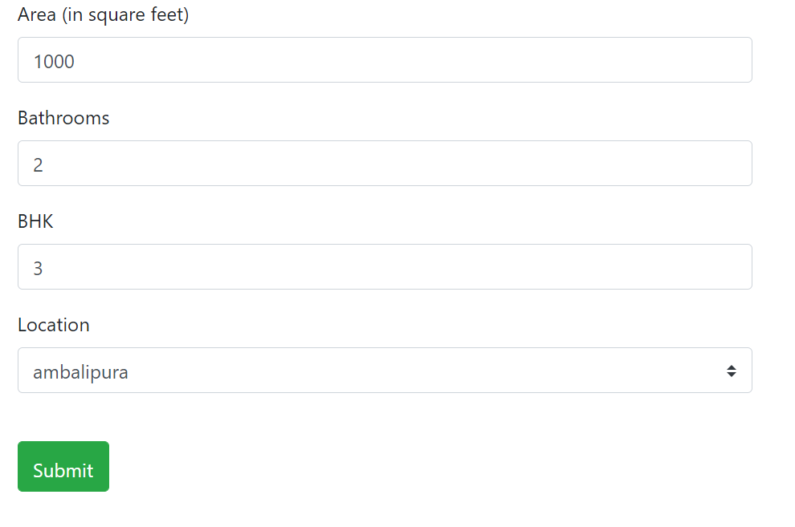
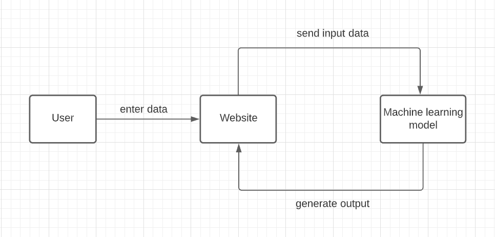

# Bengaluru House Price Prediction

Overview:

This project predicts the price of a house in Bengaluru city on the basis of features like area, bhk, number of bathrooms and location.

Input:

Output:

Flowchart of Methodology:

Live link:

https://houseprice-bengaluru.herokuapp.com/

Novelty:

This project uses linear regression model to predict the price of a house in Bengaluru city on the basis of features like area, bhk, number of bathrooms and location . The user can input values of area, bhk and number of bathrooms according to them and select a location from the dropdown list. The project supports a large number of locations in Bengaluru city which enables the user to know the price of house in almost any location of Bengaluru city.
